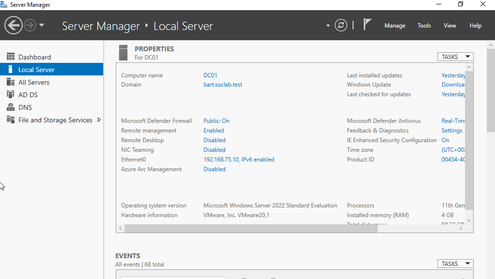
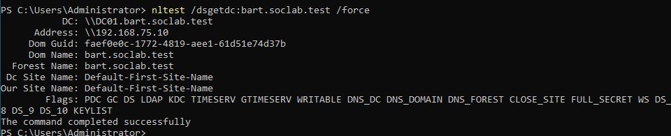
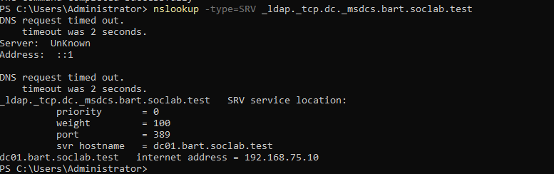
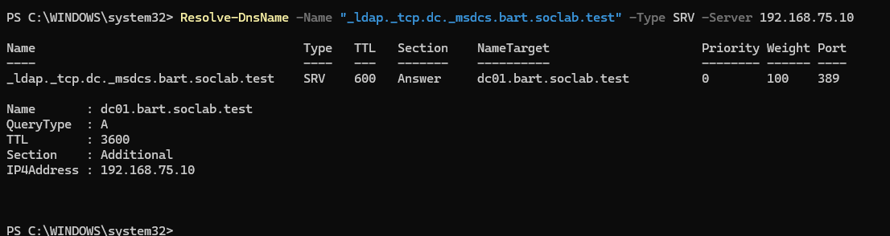
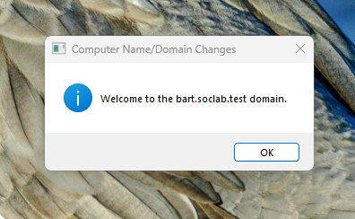
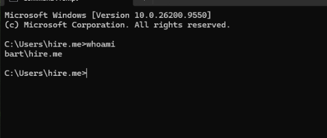
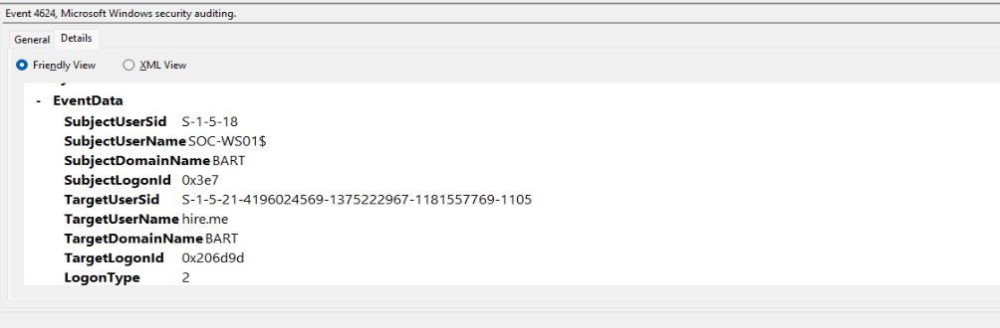
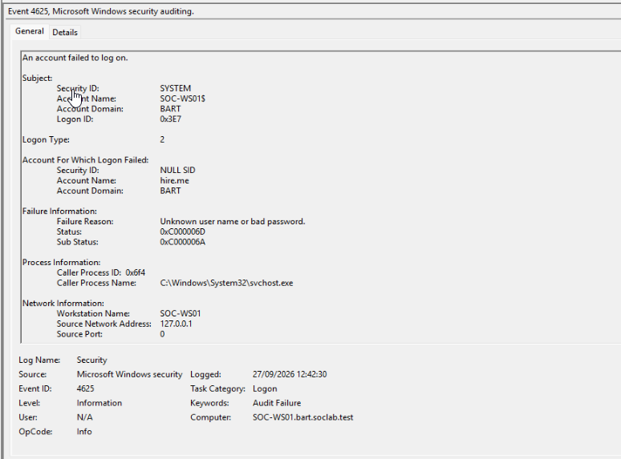
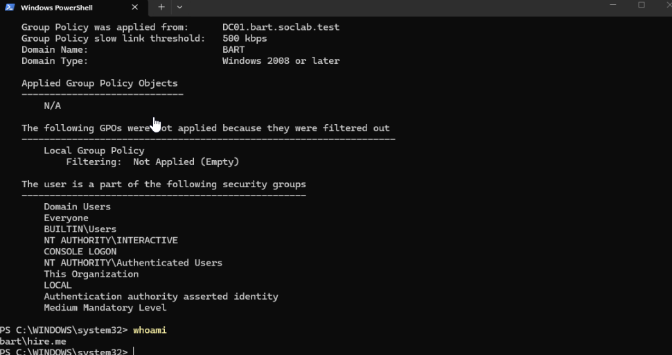
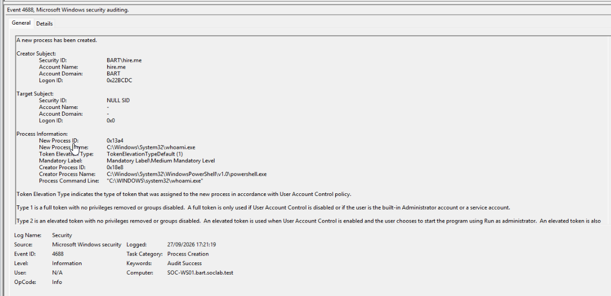

# Active Directory SOC Lab

## Overview

This project demonstrates the deployment and security monitoring of a small Active Directory environment designed for SOC analysis.

A Windows Server 2022 Domain Controller (`DC01`) was configured with Active Directory Domain Services and DNS for the `bart.soclab.test` domain. A Windows 11 workstation (`SOC-WS01`) was joined to the domain and used to generate controlled authentication and process activity.

Group Policy was used to enable security auditing, allowing Windows Security Events to be analysed for successful and failed logons, session activity, and process creation with command-line logging.

### Lab Architecture

`DC01 (Windows Server 2022)` → `Active Directory / DNS / Group Policy` → `SOC-WS01 (Windows 11)` → `Windows Security Event Logs`

## Lab Environment

| Component | Configuration |
| --- | --- |
| Hypervisor | VMware Workstation |
| Domain Controller | Windows Server 2022 (`DC01`) |
| Workstation | Windows 11 (`SOC-WS01`) |
| Active Directory Domain | `bart.soclab.test` |
| NetBIOS Domain | `BART` |
| DC / DNS Server | `192.168.75.10` |
| Network | VMware NAT (`192.168.75.0/24`) |
| Domain User | `BART\hire.me` |

## Implementation & Evidence

### 1. Domain Controller and Active Directory

A Windows Server 2022 machine was configured as the domain controller `DC01` with a static IP address of `192.168.75.10`.
Active Directory Domain Services (AD DS) and DNS were installed, and the server was promoted to a domain controller for:
`bart.soclab.test`



<br>

Domain Controller discovery was validated using `nltest`, confirming that `DC01` was discoverable as writable Domain Controller, DNS server, Kerberos Key Distribution Centre (KDC), and Global Catalog.



<br>

### 2. Active Directory DNS Validation

Active Directory relies heavily on DNS and SRV records to allow domain clients to locate services such as LDAP and Kerberos.
The LDAP Domain Controller SRV record was verified:

`_ldap._tcp.dc._msdcs.bart.soclab.test`



<br>

DNS resolution was then validated from `SOC-WS01`, confirming that the workstation could locate `DC01` at `192.168.75.10` over LDAP port `389`.



<br>

### 3. Domain Workstation and User

The Windows 11 workstation `SOC-WS01` was joined to the `bart.soclab.test` Active Directory domain.

Successful domain membership confirmed that the workstation could communicate with the Domain Controller and use Active Directory services.



A domain user account, `BART\hire.me`, was created in Active Directory and used to authenticate to the domain-joined workstation.

The authenticated identity was verified using:

```cmd
whoami
```


<br>

### 4. Windows Security Event Analysis

Windows Security auditing was used to monitor authentication activity on `SOC-WS01`.

#### Successful Interactive Logon - Event ID 4624

A successful interactive logon by the domain user `BART\hire.me` generated Windows Security Event ID `4624`.

The event recorded:

- Target user: `hire.me`
- Domain: `BART`
- Logon Type: `2` (Interactive)
- Workstation: `SOC-WS01`

Logon Type `2` indicates an interactive logon, where the user signed in directly to the workstation.



#### Failed Interactive Logon - Event ID 4625

A controlled failed authentication attempt was generated by entering an incorrect password for `BART\hire.me`.

Windows recorded Event ID `4625`, including:

- Account: `BART\hire.me`
- Logon Type: `2` (Interactive)
- Failure reason: `Unknown user name or bad password`
- Status: `0xC000006D`
- Sub Status: `0xC000006A` (incorrect password)
- Workstation: `SOC-WS01`
- Source address: `127.0.0.1`



<br>

### 5. Group Policy and Process Auditing

A custom Group Policy Object (GPO), `SOC Workstation Auditing`, was created and linked to the workstation OU to centrally configure security auditing.

The policy enabled:

- Successful and failed logon auditing
- Successful logoff auditing
- Process creation auditing
- Command-line logging for process creation events

The policy was applied to `SOC-WS01` and validated using Group Policy tools.



#### Process Creation - Event ID 4688

Process creation auditing was enabled to provide visibility into processes executed on the workstation.

A controlled test was performed by executing `whoami` from PowerShell. Windows generated Event ID `4688`, recording:

- User: `BART\hire.me`
- Process: `C:\Windows\System32\whoami.exe`
- Parent process: `powershell.exe`
- Process command line: `whoami.exe`
- Host: `SOC-WS01.bart.soclab.test`



<br>

### 6. Troubleshooting: Process Creation Auditing

During validation, the `SOC Workstation Auditing` GPO appeared as successfully applied to `SOC-WS01`, but new Event ID `4688` events were not being generated.

The effective audit configuration was checked using:

```powershell
auditpol /get /subcategory:"Process Creation"
```

The initial result showed:

```text
Process Creation    No Auditing
```

This demonstrated that a successfully applied GPO does not necessarily confirm that an individual audit subcategory is active.

The GPO configuration was reviewed and the Advanced Audit Policy settings were corrected. The policy was then refreshed using:

```powershell
gpupdate /force
```

A second `auditpol` check confirmed:

```text
Process Creation    Success
```

After validation, executing `whoami` successfully generated Event ID `4688` with the process name, parent process, user context, and command line.

This troubleshooting process demonstrated the importance of validating the effective endpoint configuration rather than relying only on GPO application status.

<br>

## Skills Demonstrated

- Deployed and configured Active Directory Domain Services (AD DS) and DNS
- Configured a Windows Server 2022 Domain Controller
- Joined a Windows 11 workstation to an Active Directory domain
- Managed domain users, computers, and organisational units (OUs)
- Configured security auditing centrally using Group Policy
- Analysed Windows Security Events `4624`, `4625`, `4634`, and `4688`
- Interpreted logon types, authentication failures, process relationships, and command-line activity
- Validated effective audit policy using `auditpol` and Group Policy tools
- Troubleshot an Advanced Audit Policy configuration issue
- Generated controlled endpoint activity for security monitoring and investigation

<br>

## Relevance to a Cybersecurity Analyst Role

This project reflects several tasks relevant to a Cybersecurity Analyst working in a SOC environment. Windows authentication and process creation events provide valuable telemetry for investigating suspicious user and endpoint activity.

Understanding events such as failed logons, successful authentication, and process execution can help an analyst identify potential brute-force attempts, compromised accounts, and suspicious command execution.

The lab also demonstrates the importance of validating security controls and telemetry before relying on them during an investigation.

<br>

## Conclusion

This lab established a functional Active Directory environment with centralised security auditing for a domain-joined Windows workstation.
Authentication and process activity were generated, validated, and analysed using Windows Security Events, providing practical experience with endpoint telemetry commonly used in SOC investigations.
The next stage of the lab will extend this environment into Microsoft Sentinel, where Windows security logs will be centralised and analysed using KQL.
