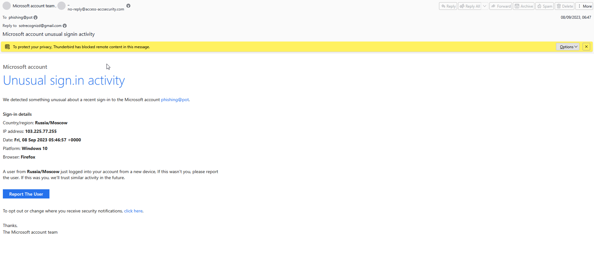
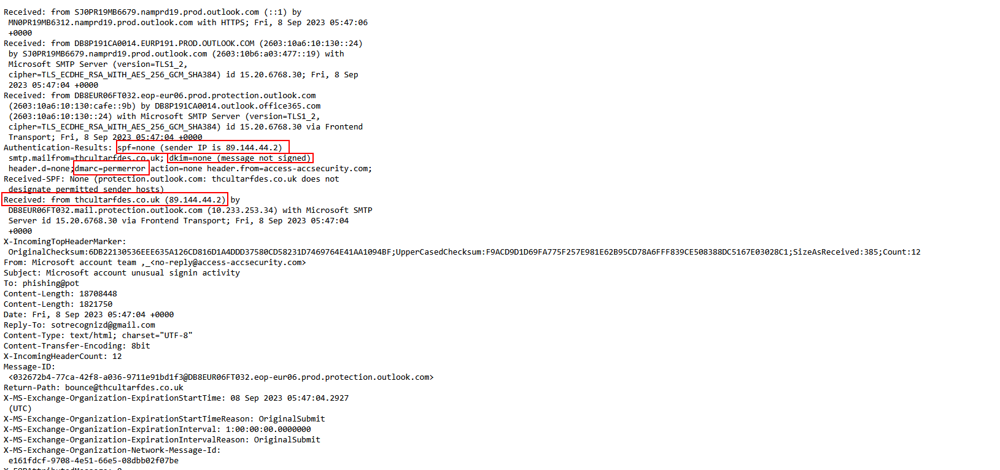
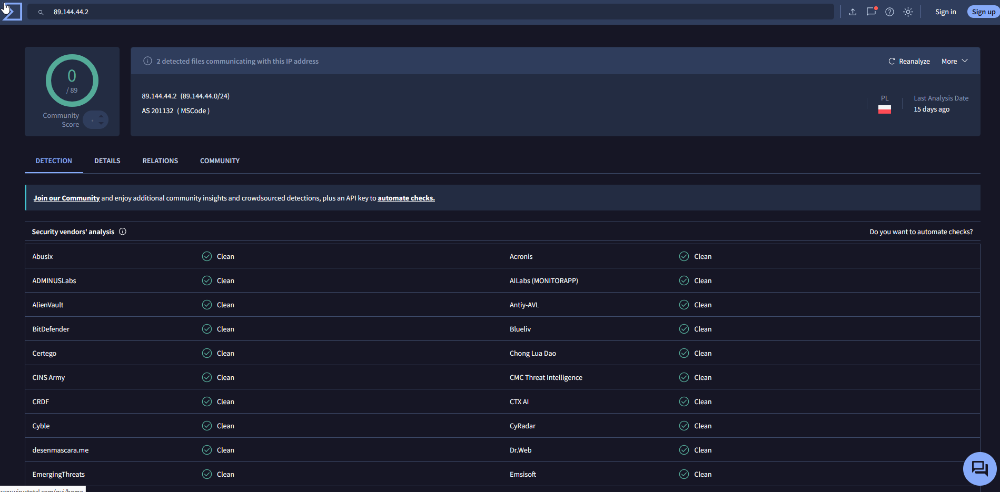
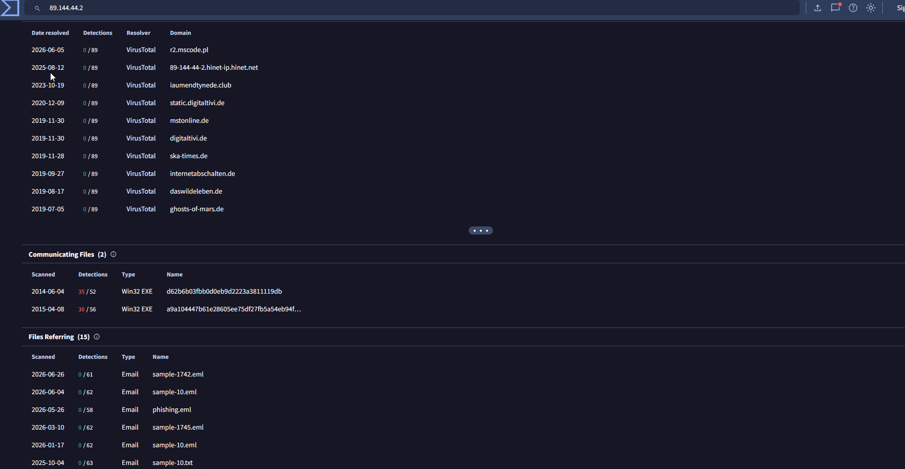
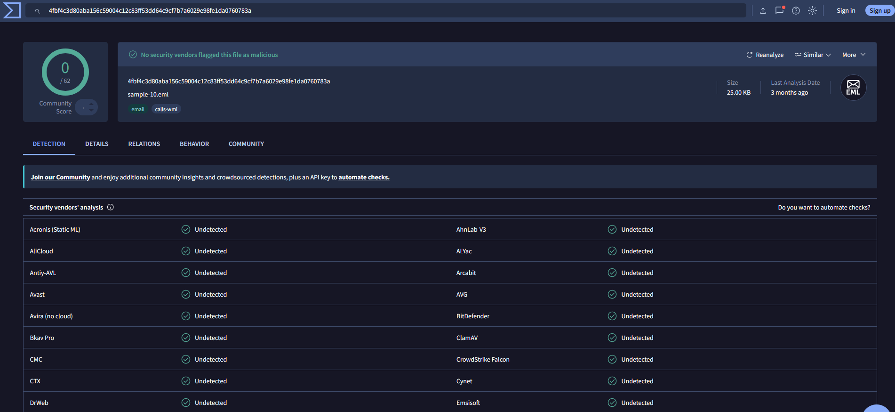
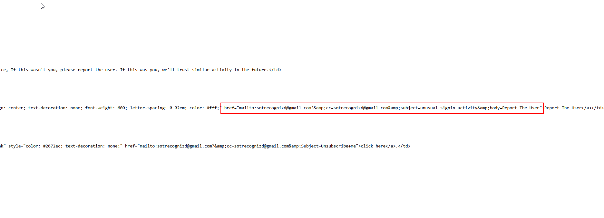

# Email Phishing Investigation

## Project Information

| Category | Value |
| --------- | ------ |
| Difficulty | Beginner |
| Estimated Time | 1-2 hours |
| Environment | VMware Workstation |
| Operating System | Windows 11 |
| Skills | Email Analysis, IOC Extraction, Threat Intelligence |

## Case Scenario

A user reported a suspicious email claiming to be from the Microsoft account team. The email stated that unusual sign-in activity had been detected from Russia and instructed the recipient to report the activity using a button contained within the email.
As a SOC analyst, my task is to investigate the email and determine whether it is legitimate or part of phishing attempt. The investigation will focus on the sender, email headers, embedded URLs, social engineering techniques, and any indicators of compromise (IOCs)

## Objective

The objective of this project is to investigate a suspicious email suspected of being a phishing attempt. The investigation aims to identify indicators of compromise (IOCs), analyse email headers, inspect embedded URLs and evaluate the legitimacy of the sender. All findings will be documented using a structured investigation methodology.

### Step 1 - Initial Email Triage

The email claimed to originate from the Microsoft account team and warned the recipient about unusual sign-in activity from Russia/Moscow.

Initial inspection identified several suspicious characteristics:

- The sender address `no-reply@access-accsecurity.com` does not belong to an official Microsoft domain.
- The "Reply-To" address was set to `sotrecognizd@gmail.com`, which does not match the sender domain.
- The message used account security concerns and a suspicious sign-in alert to create a sense of urgency.
- The email encouraged the recipient to interact with a "Report The User" button.
- The email contained spelling and formatting inconsistencies, such as "Unusual sign.in activity" instead of "Unusual sign-in activity".

### Step 2 - Email Header Analysis

The email headers were examined to identify the sender infrastructure, authentication results and inconsistencies between sender-related addresses.

The header analysis identified the following findings:

- The visible sender address was `no=reply@access-accsecurity.com`, while the "Reply-To" address was `sotrecognizd@gmail.com`.
- The "Return-Path" was set to `bounce@thcultarfdes.co.uk`, introducing another domain associated with the message.
- SPF returned "none", meaning the message did not receive a positive SPF authentication result.
- DKIM returned "none", indicating that the message was not signed with DKIM.
- DMARC returned "permerror", indicating a permanent error during DMARC evaluation
- The earliest relevant external "Received" header showed the message being received from `thcultarfdes.co.uk` (89.144.44.2) by Microsoft email infrastructure.
- Subsequent "Received" headers showed the message passing through Microsoft/Outlook infrastructure before reaching the recipient.

### Step 3 - Threat Intelligence Analysis

The sender IP address "89.144.44.2", identified during the email header analysis, was investigated using VirusTotal to gather additional threat intelligence.

VirusTotal reported that the IP address was not currently flagged as malicious by any of the 89 security vendors. However, additional context showed:

- The IP address belongs to the "89.144.44.0/24" network range.
- VirusTotal associated the address with AS201132 (MSCode) in Poland.
- Two previously analysed executable files were recorded as communicating with this IP address.
- Mulitple email files were listed as referring to the IP address.

The absence of current vendor detections was not treated as evidence that the IP address was safe, particularly because the investigated email was received in 2023 and IP reputation can change over time.

The SHA-256 hash of tem email sample was also calculated and searched in VirusTotal:

"4fbf4c3d80aba156c59004c12c83ff53dd64c9cf7b7a6029e98fe1da0760783a"

VirusTotal identified the file as "sample-10.eml" and reported "0/62" security vendor detections.

Although no security vendor flagged the email files as malicious, this result does not by itself establish that the email is legitimate. Manual analysis of the sender information, authentication results, email content and social engineering indicators remains necessary when assessing the message.

### Step 4 - Call-to-Action Analysis

The HTML source of the email was inspected to determine the actual behaviour of the "Report The User" button without clicking it.

The analysis revealed that the button did not redirect the recipient to a Microsoft website. Instead, it used a "mailto:" link addressed to `sotrecognizd@gmail.com`.

The link also attempted to pre-populate the email with the subject "unusual signin activity" and the message body "Report The User".

The same Gmail address was previously identified in the "Reply-To" header, creating a direct connection between the email's reply mechanism and its call-to-action.

This finding further increased suspicion because the message claimed to represent Microsoft while directing user interaction to an unrelated Gmail address.

## Indicators of Compromise (IOCs)

The following indicators were extracted during the investigation:

| Type | Indicator |
| ------ | ------ |
| Sender Email | `no-reply@access-accsecurity.com` |
| Reply-To Email | `sotrecognizd@gmail.com` |
| Return Path | `bounce@thcultarfdes.co.uk` |
| Sender Domain | `access-accsecurity.com` |
| Return Path Domain | `thcultarfdes.co.uk` |
| Sender IP | "89.144.44.2" |
| SHA-256 | "4fbf4c3d80aba156c59004c12c83ff53dd64c9cf7b7a6029e98fe1da0760783a" |

## Findings

The investigation determined that the email was a
phishing attempt impersonating the Microsoft account
team.

This assessment was based on multiple findings:

- The sender used `access-accsecurity.com`, which is
  unrelated to Microsoft's official domains.
- The `Reply-To` address pointed to an unrelated Gmail
  account: `sotrecognizd@gmail.com`.
- The `Return-Path` used a different domain:
  `thcultarfdes.co.uk`.
- Email authentication did not produce successful SPF
  or DKIM results, while DMARC returned a `permerror`.
- The message used a suspicious sign-in alert to create
  urgency and encourage user interaction.
- The "Report The User" button used a `mailto:` link
  directing the recipient to `sotrecognizd@gmail.com`
  rather than to a Microsoft service.
- The email contained spelling and formatting
  inconsistencies, including `Unusual sign.in activity`.

VirusTotal did not currently classify the sender IP or
email sample as malicious. However, these results did
not outweigh the multiple indicators identified during
manual analysis.

Based on the combined evidence, the email was classified
as a phishing attempt using Microsoft impersonation and
social engineering.

## MITRE ATT&CK Mapping

The observed activity was mapped to the MITRE ATT&CK
framework based on the behaviour identified during the
investigation.

| Tactic | Technique | ID |
| --- | --- | --- |
| Initial Access | Phishing | T1566 |

The email used social engineering and Microsoft
impersonation to encourage the recipient to interact
with the message.

No malicious web URL or attachment was identified,
therefore a more specific phishing sub-technique was
not assigned.

## Recommendations

Based on the investigation findings, the following
actions are recommended:

- Block the identified sender address and associated
  domains where appropriate.
- Block or monitor the sender IP `89.144.44.2` after
  validating potential legitimate use within the
  organisation.
- Search the email environment for other messages
  containing the identified sender addresses, domains
  or similar subject lines.
- Remove matching phishing emails from affected
  mailboxes.
- Report the phishing message to the appropriate
  security or email administration team.
- Advise users not to interact with unexpected account
  security alerts and to verify notifications through
  official Microsoft services.

  ## Skills Demonstrated

This investigation demonstrated practical experience
with the following SOC analyst skills:

- Phishing email triage and investigation
- Email header analysis
- SPF, DKIM and DMARC interpretation
- Email delivery path analysis using `Received` headers
- IOC identification and extraction
- Passive threat intelligence using VirusTotal
- SHA-256 file hashing and reputation analysis
- HTML source and `mailto:` link analysis
- Social engineering identification
- MITRE ATT&CK mapping
- Evidence collection and investigation documentation

## Lessons Learned

This investigation demonstrated that phishing emails
cannot be assessed based on appearance alone.

Key lessons from the investigation include:

- Sender display names should not be trusted without
  analysing the underlying email address and headers.
- SPF, DKIM and DMARC results provide useful context
  when assessing email authenticity.
- `Received` headers can be used to reconstruct the
  email delivery path and identify relevant
  infrastructure.
- URLs and buttons should be inspected without
  interacting with them directly.
- Threat intelligence results should be treated as
  supporting evidence rather than a final verdict.
- A `0` detection result in VirusTotal does not
  automatically mean that an email or IP address is
  safe.
- IOCs should be selected based on evidence and context
  rather than extracting every IP address or domain
  present in a message.

  ## Conclusion

The investigation confirmed that the analysed email was
a phishing attempt impersonating the Microsoft account
team.

Analysis of the email headers, authentication results,
sender infrastructure and call-to-action revealed
multiple indicators inconsistent with a legitimate
Microsoft security notification.

The investigation also demonstrated the importance of
combining manual analysis with threat intelligence.
Although VirusTotal did not flag the email sample or
sender IP as malicious, the evidence collected during
the investigation supported the phishing classification.

The email was analysed without interacting with
potentially suspicious external content.
