# Microsoft Sentinel SOC Lab

## Overview

This project demonstrates the implementation of a cloud-based
Security Information and Event Management (SIEM) solution using
Microsoft Sentinel to monitor a local Active Directory lab environment.

A domain-joined Windows 11 workstation was connected to Azure
using Azure Arc and Azure Monitor Agent (AMA). Selected Windows
Security Events were collected and analysed using Kusto Query
Language (KQL).

A custom detection rule was developed to identify multiple failed
logon attempts. Controlled authentication tests were then performed
to trigger an alert, investigate the resulting incident, and
document its resolution.

The project demonstrates practical SOC analyst activities,
including security log collection, threat detection, alert
investigation, and incident classification.

## Lab Architecture

This project builds on my existing Active Directory SOC Lab
by integrating a domain-joined Windows 11 workstation with
Microsoft Sentinel.

The lab environment consists of the following components:

- **DC01:** Windows Server 2022 Domain Controller providing
  Active Directory Domain Services (AD DS) and DNS.
- **SOC-WS01:** Windows 11 workstation joined to the
  `bart.soclab.test` domain.
- **Azure Arc:** Connects the workstation to Azure.
- **Azure Monitor Agent (AMA):** Collects Windows Security Events.
- **Data Collection Rule (DCR):** Defines which security events
  are collected.
- **Log Analytics Workspace:** Stores the collected security logs.
- **Microsoft Sentinel:** Provides centralised security monitoring,
  KQL-based analysis, threat detection and incident investigation.

### Log Collection Workflow

The security monitoring workflow follows these stages:

1. Security events are generated on SOC-WS01.
2. Azure Monitor Agent collects the selected Windows Security Events
   according to the configured Data Collection Rule.
3. The collected events are forwarded to the Log Analytics Workspace.
4. Microsoft Sentinel uses KQL to analyse the collected events.
5. A custom scheduled detection rule identifies multiple failed
   logon attempts.
6. The resulting alert and incident are investigated and classified.

### Architecture Diagram

```text
DC01 (Windows Server 2022)
   Active Directory / DNS
             |
             v
   SOC-WS01 (Windows 11)
             |
             v
         Azure Arc
             |
             v
   Azure Monitor Agent
             |
             v
   Data Collection Rule
             |
             v
  Log Analytics Workspace
             |
             v
    Microsoft Sentinel
             |
             v
   Custom Detection Rule
             |
             v
     Alert and Incident
             |
             v
   Incident Investigation
```

## Environment Setup

### Microsoft Sentinel and Log Analytics

A Log Analytics Workspace named `law-sentinel-soc-lab` was created
in the UK South Azure region within the `rg-sentinel-soc-lab`
resource group.

Microsoft Sentinel was then enabled for the workspace to provide
centralised security monitoring and incident management.

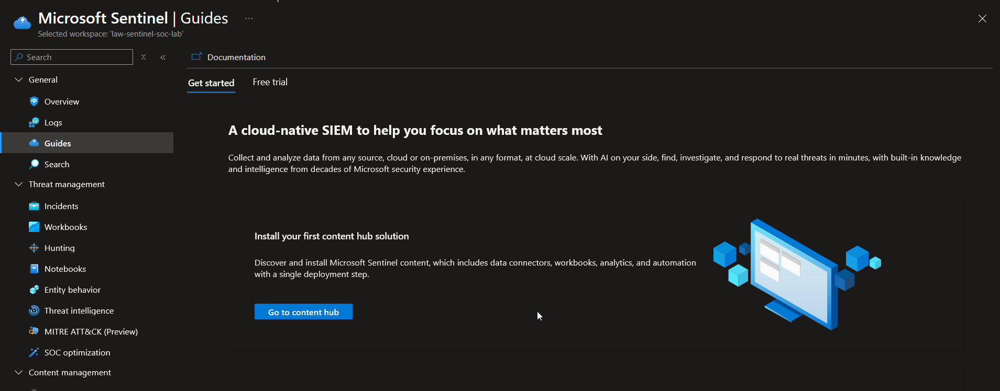

<br>

### Connecting the Workstation with Azure Arc

The domain-joined Windows 11 workstation, `SOC-WS01`, was connected to Azure using Azure Arc.

Azure Monitor Agent (AMA) and a Data Collection Rule (DCR) were configured to collect Windows Security Events and forward them
to the Log Analytics Workspace.

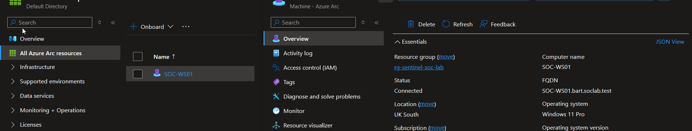

<br>

## Log Collection and Initial Analysis

### Verifying Security Event Collection

After configuring Azure Monitor Agent and the Data Collection Rule,
I used Kusto Query Language (KQL) to verify that Windows Security
Events from SOC-WS01 were successfully collected in Microsoft Sentinel.

The following query counted the collected events by Event ID:

```kql
SecurityEvent
| where Computer contains "SOC-WS01"
| summarize EventCount = count() by EventID
| order by EventCount desc
```

The initial results included:

- **Event ID 4688:** Process creation (177 events).
- **Event ID 4624:** Successful logon (14 events).
- **Event ID 4625:** Failed logon (2 events).

These results confirmed that Windows Security Events were being
collected and could be queried centrally.

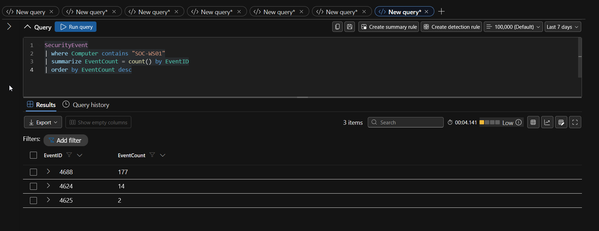

### Initial Failed Logon Analysis

I then investigated Event ID 4625 to examine failed authentication
attempts and identify useful information for security monitoring.

```kql
SecurityEvent
| where EventID == 4625
| project TimeGenerated, Account, LogonType,
          Status, SubStatus, FailureReason
| order by TimeGenerated desc
```

The initial investigation revealed failed logon events involving
domain accounts, including `BART\hire.me` and `BART\Administrator`.

The results included the following values:

- **Status 0xC000006D:** Authentication failure.
- **SubStatus 0xC000006A:** Incorrect password.
- **LogonType 2:** Interactive logon.
- **LogonType 11:** Cached interactive logon.

This initial analysis helped identify the event fields needed
to develop a custom detection rule for repeated failed logons.

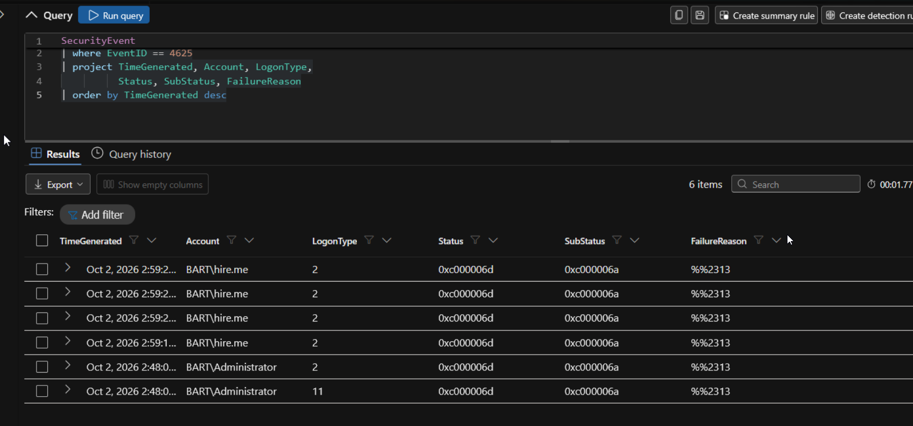

<br>

## Detection Engineering

### Custom Detection Rule

Following the initial log analysis, I created a custom scheduled detection rule named `SOC - Multiple Failed Logon Attempts`.

The rule was designed to identify accounts experiencing five or more failed Windows logon attempts on the same computer within a fixed five-minute period.

The detection was configured with:

- **Severity:** Medium
- **Detection type:** Custom scheduled rule
- **MITRE ATT&CK tactic:** Credential Access
- **MITRE ATT&CK technique:** T1110 – Brute Force
- **MITRE ATT&CK sub-technique:** T1110.001 – Password Guessing

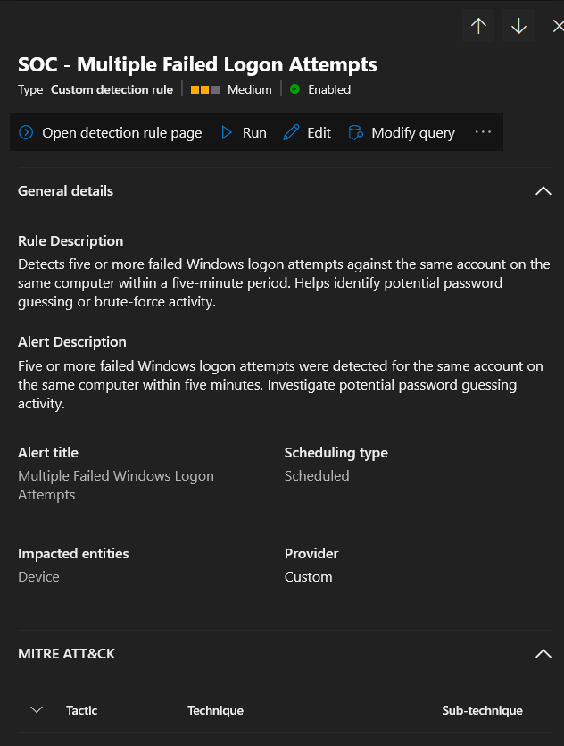

### Detection Logic Using KQL

The following KQL query was used to identify repeated failed logon attempts:

```kql
SecurityEvent
| where EventID == 4625
| summarize FailedAttempts = count(),
            FirstAttempt = min(TimeGenerated),
            LastAttempt = max(TimeGenerated)
    by Account, Computer, bin(TimeGenerated, 5m)
| where FailedAttempts >= 5
| project FirstAttempt, LastAttempt,
          Account, Computer, FailedAttempts
| order by FailedAttempts desc
```

The query filters Windows Security Events for Event ID 4625 and groups failed authentication attempts by account, computer and fixed five-minute time intervals.

It then returns results where at least five failed attempts occurred within the same interval.

This approach helps identify activity consistent with potential password guessing, although additional investigation is required to determine whether the activity is malicious.

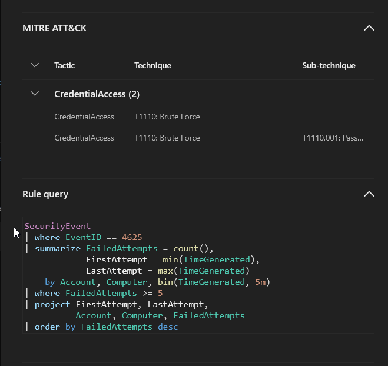

<br>

### Alert Generation

To validate the custom detection rule, I performed a controlled
authentication test by generating multiple failed logon attempts
against the `BART\hire.me` account on `SOC-WS01`.

The activity triggered the custom detection rule and generated
an alert named `Multiple Failed Windows Logon Attempts`.

The alert appeared in the Microsoft Defender portal with the
following details:

- **Severity:** Medium
- **Status:** New
- **Category:** Credential Access
- **Detection source:** Custom detection

This confirmed that the detection rule could identify the
simulated password-guessing activity and generate an alert
for further investigation.

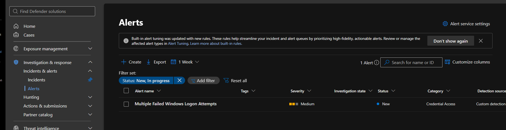

## Incident Investigation

### Incident Creation

Following the controlled authentication test, the generated alert
was associated with an incident in the Microsoft Defender portal.

The incident was initially marked as Active, with Medium severity,
and contained one alert associated with the SOC-WS01 workstation.

I opened the incident to review its details, examine the affected
device and investigate the authentication activity.

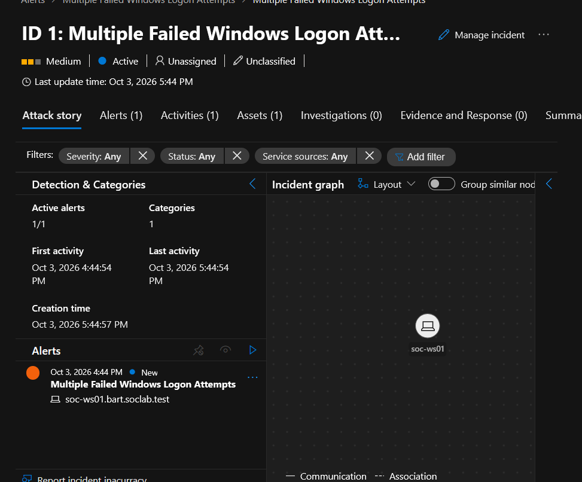

### Analysing the Failed Logon Attempts

The incident's query results revealed six failed authentication
attempts against the `BART\hire.me` account on
`SOC-WS01.bart.soclab.test`.

The first recorded attempt occurred at 17:20:45 and the last
at 17:21:10 on 3 October 2026.

These results confirmed that the activity met the detection
threshold of at least five failed attempts within a fixed
five-minute interval.

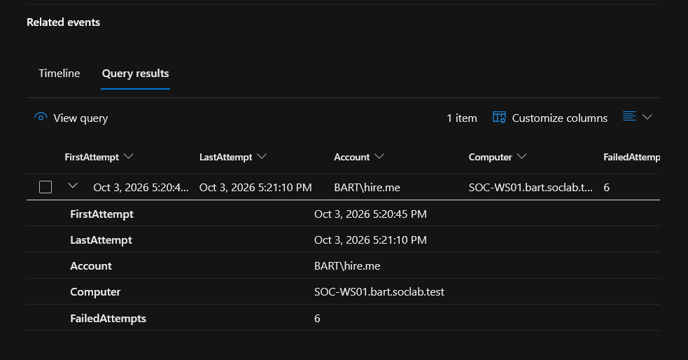

### Investigating the Authentication Events

I performed further KQL analysis to examine the authentication
details and determine the nature of the activity.

The investigation identified the following information:

- **Event ID:** 4625 – Failed Windows logon
- **Account:** BART\hire.me
- **Computer:** SOC-WS01.bart.soclab.test
- **Failed attempts:** 6
- **Logon type:** 2 – Interactive logon
- **Status:** 0xC000006D – Authentication failure
- **SubStatus:** 0xC000006A – Incorrect password
- **Source IP:** 127.0.0.1 – Local loopback address

The evidence indicated repeated incorrect password attempts
during an interactive logon. The loopback address did not
indicate an external source.

Because the activity was generated as part of an authorised
security test, there was no evidence of a genuine attack
or successful account compromise.

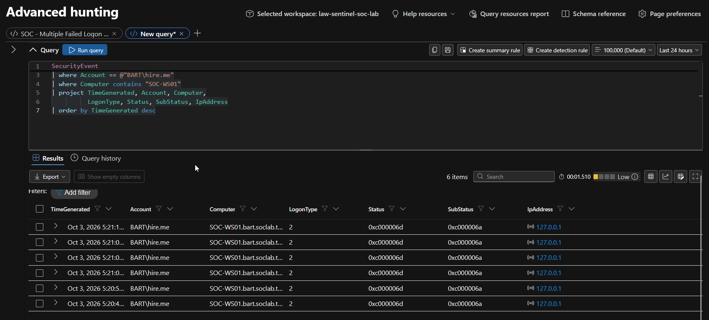

<br>

## Incident Resolution

### Incident Classification

After reviewing the authentication events, I confirmed that the
failed logon attempts were generated during an authorised security
test in my lab environment.

The custom detection rule correctly identified the activity and
generated an alert. However, the investigation confirmed that
the activity was expected rather than malicious.

I assigned the incident to myself and resolved it with the
following classification:

- **Incident status:** Resolved
- **Classification:** Benign Positive
- **Reason:** Informational, expected activity – Security testing

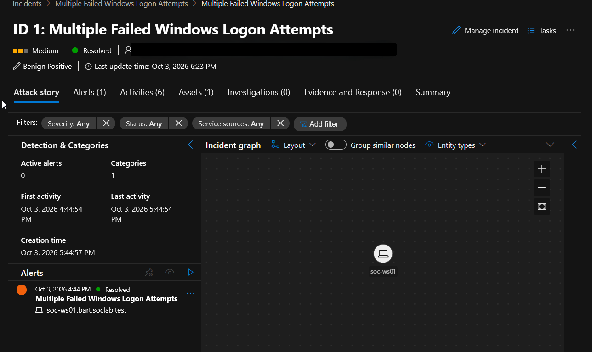

### Investigation Outcome

The investigation demonstrated the complete detection and
incident response workflow, from collecting Windows Security
Events to generating an alert, investigating the evidence and
resolving the incident.

The detection was successful because it identified the repeated
failed logon attempts as intended.

The incident was classified as Benign Positive rather than
False Positive because the detection correctly identified
real authentication failures generated during an authorised
security test.

## Skills Demonstrated

This project allowed me to develop and demonstrate practical
skills relevant to a Security Operations Centre (SOC) environment:

- **SIEM Implementation:** Configuring Microsoft Sentinel and
  integrating a local Windows workstation with Azure.
- **Security Log Collection:** Using Azure Arc, Azure Monitor
  Agent and Data Collection Rules to collect Windows Security Events.
- **Log Analysis:** Writing KQL queries to investigate Windows
  authentication events and identify suspicious activity.
- **Detection Engineering:** Developing a custom detection rule
  for repeated failed logon attempts.
- **MITRE ATT&CK:** Mapping detection logic to Credential Access
  and Password Guessing techniques.
- **Incident Investigation:** Examining alerts, affected devices
  and authentication event details.
- **Incident Classification:** Distinguishing authorised security
  testing from potentially malicious activity.

## SOC Analyst Relevance

This project simulates a practical SOC monitoring and investigation
workflow, from security event collection to incident resolution.

Repeated failed logon attempts can indicate password guessing,
particularly when multiple failures target the same account
within a short period. However, an alert alone does not confirm
malicious activity.

During this investigation, I examined the affected account,
workstation, authentication failure codes, logon type and
source IP address to understand the context of the alert.

The controlled test demonstrated the importance of validating
detections, investigating supporting evidence and accurately
classifying incidents rather than treating every alert as
a confirmed security threat.

The same investigation approach can be applied to real SOC
environments when analysing suspicious authentication activity.
